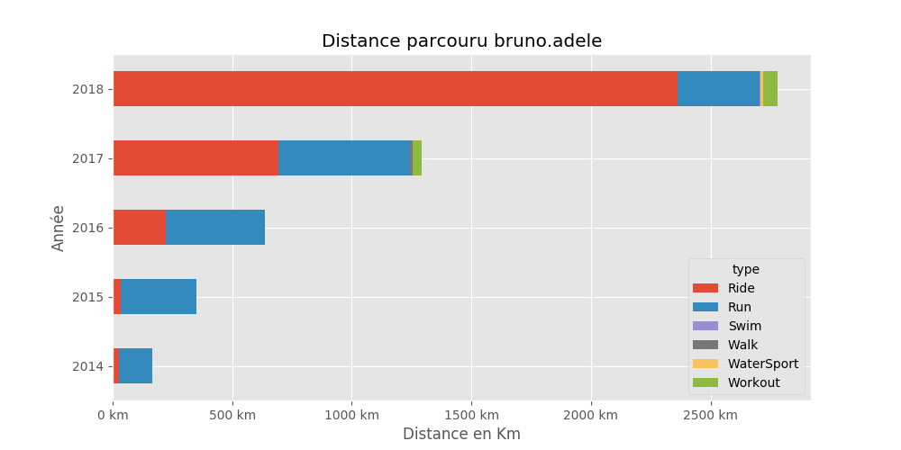
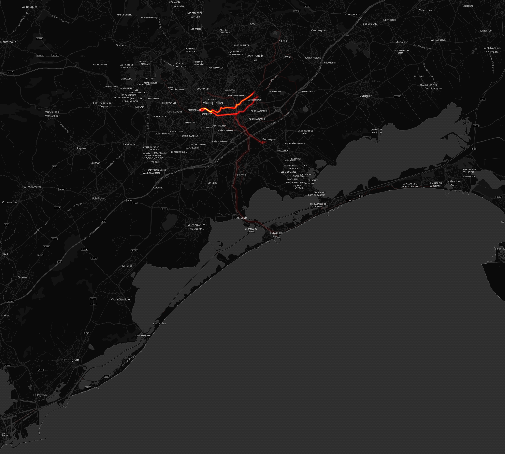
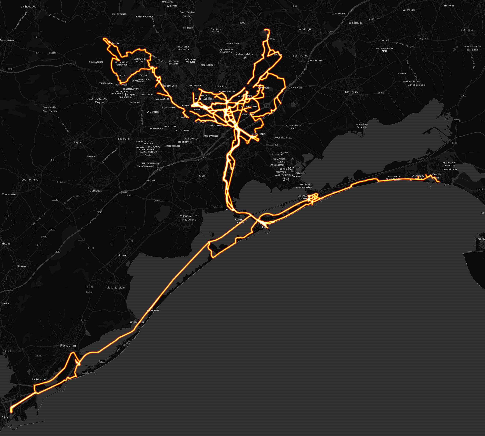

# Bruno Adelé

## Résumé

Distance totale parcourue pour toutes les activitées **5224 Km**

|   year |   Ride |   Run |   Swim |   Walk |   WaterSport |   Workout |
|-------:|-------:|------:|-------:|-------:|-------------:|----------:|
|   2018 | 2363   | 342.9 |    2.5 |    0   |         12.4 |      59.4 |
|   2017 |  691.2 | 551.1 |    0   |   12.4 |          0   |      35.6 |
|   2016 |  221.4 | 416.6 |    0   |    0   |          0   |       0   |
|   2015 |   35.5 | 313.7 |    0   |    0   |          0   |       0   |
|   2014 |   26.5 | 140.5 |    0   |    0   |          0   |       0   |

## Montpellier

#### Trajets les plus fréquents

#### Zones de croisements

#### Ensembles des trajets

## France

#### Trajets les plus fréquents

#### Ensembles des trajets

