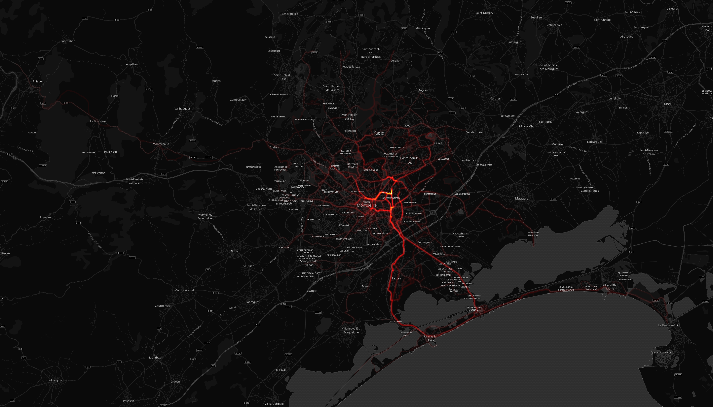

# Cedric Brousse

## Résumé

Distance totale parcourue pour toutes les activitées **7377.148 Km**

|   year |   Course à pied |   Entraînement |   Escalade |   Marche |   Natation |   Randonnée |   Raquettes |   Sortie à vélo |   Sortie à vélo électrique |
|-------:|----------------:|---------------:|-----------:|---------:|-----------:|------------:|------------:|----------------:|---------------------------:|
|   2019 |           288.4 |            2   |        0   |      5.1 |        0   |        98.3 |           0 |          1697.3 |                          7 |
|   2018 |           655.2 |            0   |        0.5 |      0   |        0   |       130.4 |           3 |          1110.2 |                          0 |
|   2017 |           729.8 |           17.5 |        0   |      4.8 |        1.6 |       136.4 |           0 |           907.9 |                          0 |
|   2016 |           378.7 |            0.2 |        0   |      0   |        0   |       116.4 |           0 |           589.3 |                          0 |
|   2015 |            57.3 |            0   |        0   |      0   |        0   |         0   |           0 |           439.4 |                          0 |

Comparaison des économies entre un velo+frais (**0 €**) et un véhicule consommant **5.28 l**/100km pour un prix de **8.128 €** pour 100Km.

Sur l'ensenble des trajets vélo, **584.0 kg** d'émission de CO2 ont été évités et une économie de **401 €** a pu être réalisé.

|   year |   Nb trajets |   Distance(Km) |   Eco CO2 en Kg |   Eco Ess. en € |   Economie VS Auto-Moto |
|-------:|-------------:|---------------:|----------------:|----------------:|------------------------:|
|   2019 |           68 |        1697.33 |        208.772  |        143.39   |                400.78   |
|   2018 |           57 |        1110.16 |        136.55   |         93.7863 |                257.389  |
|   2017 |           51 |         907.94 |        111.677  |         76.7028 |                163.603  |
|   2016 |           22 |         589.3  |         72.4839 |         49.7841 |                 86.9004 |
|   2015 |           14 |         439.35 |         54.0401 |         37.1163 |                 37.1163 |

## Montpellier

#### Trajets les plus fréquents

#### Zones de croisements

#### Ensembles des trajets

## France

#### Trajets les plus fréquents

#### Ensembles des trajets

