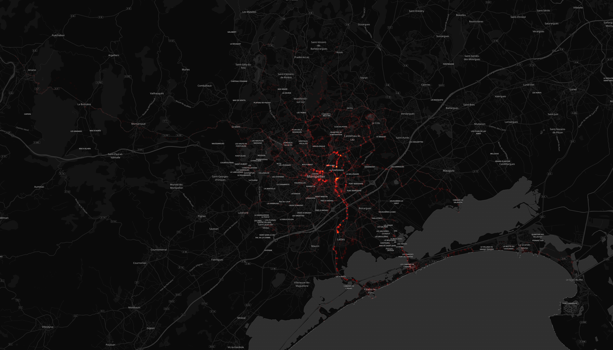
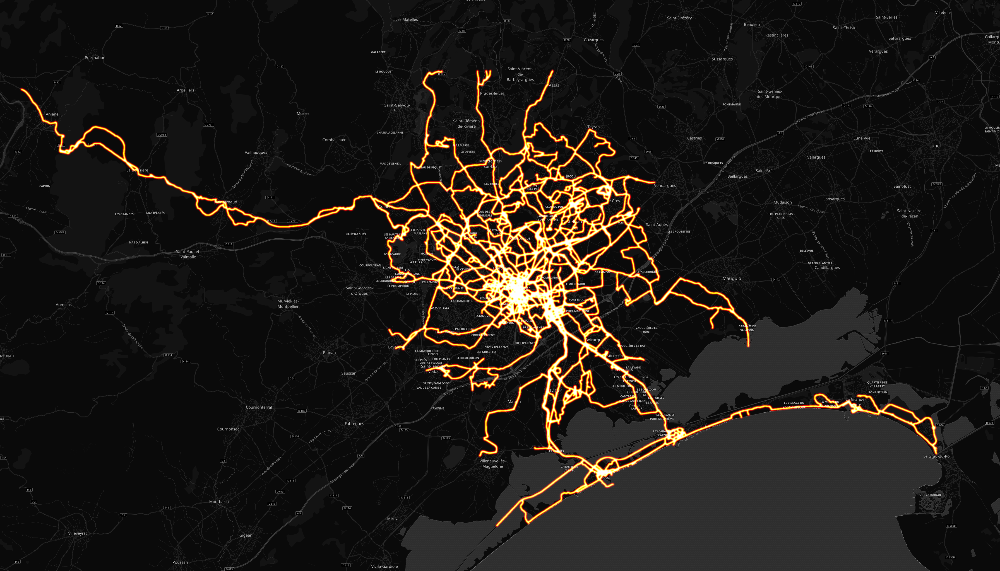

# Cedric Brousse

## Résumé

Distance totale parcourue pour toutes les activitées **5364 Km**

|   year |   Hike |   Ride |   Run |   Snowshoe |   Swim |   Walk |   Workout |
|-------:|-------:|-------:|------:|-----------:|-------:|-------:|----------:|
|   2019 |    0   |   31.8 |  52.2 |          0 |    0   |    0   |       0   |
|   2018 |  130.5 | 1110.4 | 655.4 |          3 |    0   |    0   |       0.5 |
|   2017 |  136.5 |  908.2 | 730.1 |          0 |    1.6 |    4.8 |      17.6 |
|   2016 |  116.4 |  589.4 | 378.9 |          0 |    0   |    0   |       0.2 |
|   2015 |    0   |  439.4 |  57.3 |          0 |    0   |    0   |       0   |

## Montpellier

#### Trajets les plus fréquents

#### Zones de croisements

#### Ensembles des trajets

## France

#### Trajets les plus fréquents

#### Ensembles des trajets

