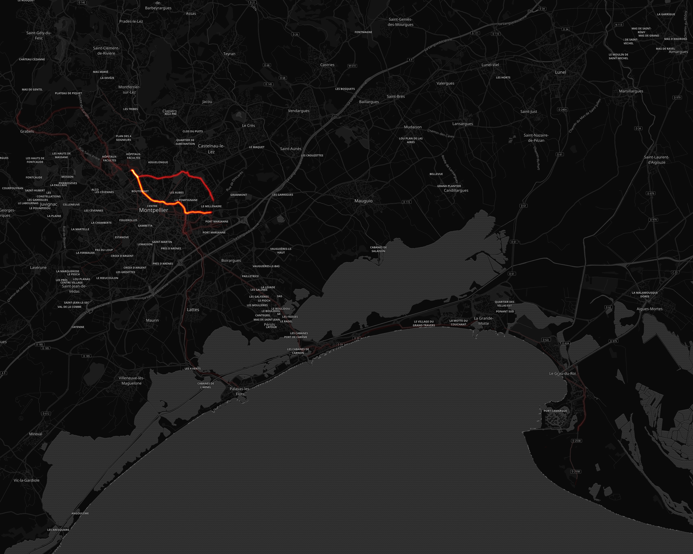

# DetDidine

## Résumé

Distance totale parcourue pour toutes les activitées **3271 Km**

|   year |   Ride |   Run |   Walk |
|-------:|-------:|------:|-------:|
|   2019 | 3210.3 |   0.8 |    6.7 |
|   2018 |   53.6 |   0   |    0   |

Comparaison des économies entre un velo et l'utilisation d'un véhicule motorisé consommant **5.28 l**/100km pour un prix de **8.128 €** pour 100Km.

Sur l'ensenble des trajets vélo, **401.0 kg** d'émission de CO2 ont été évités et une économie de **276 €** a pu être réalisé.

|   year |   Nb trajets |   Distance(Km) |   Eco CO2 en Kg |   Eco Ess. en € |   Economie VS Auto-Moto |
|-------:|-------------:|---------------:|----------------:|----------------:|------------------------:|
|   2019 |          524 |        3210.27 |       394.863   |       271.204   |               275.73    |
|   2018 |            9 |          53.58 |         6.59034 |         4.52644 |                 4.52644 |

## Montpellier

#### Trajets les plus fréquents

#### Zones de croisements

#### Ensembles des trajets

## France

#### Trajets les plus fréquents

#### Ensembles des trajets

