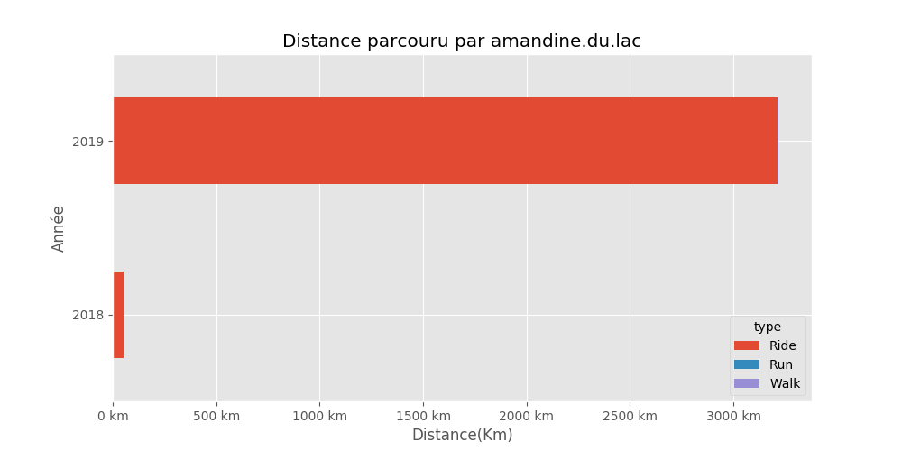
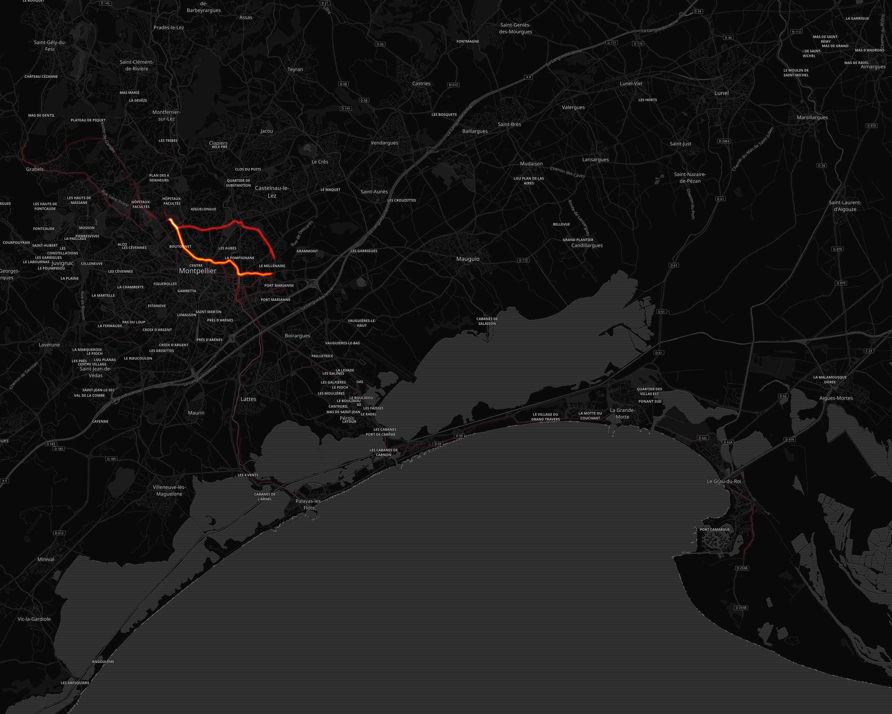
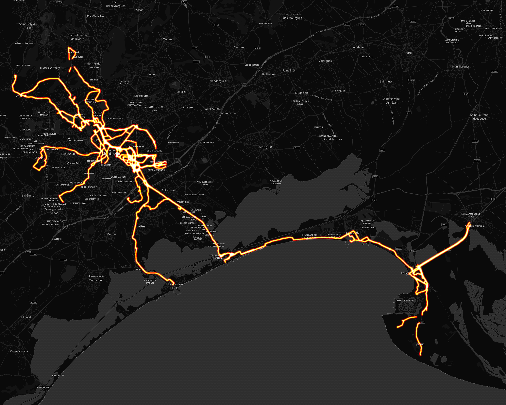

# DetDidine

## Résumé

Distance totale parcourue pour toutes les activitées **{{DISTANCEALLACTIVITIES}} Km**

{{SUMMARYALLACTIVITIES}}

Comparaison des économies entre un velo et l'utilisation d'un véhicule motorisé consommant **{{LITRES}} l**/100km pour un prix de **{{EUROS}} €** pour 100Km.

Sur l'ensenble des trajets vélo, **{{CO2}} kg** d'émission de CO2 ont été évités et une économie de **{{ECONOMY}} €** a pu être réalisé.

{{SUMMARYECONOMY}}

## Montpellier

#### Trajets les plus fréquents

#### Zones de croisements

#### Ensembles des trajets

## France

#### Trajets les plus fréquents

#### Ensembles des trajets

