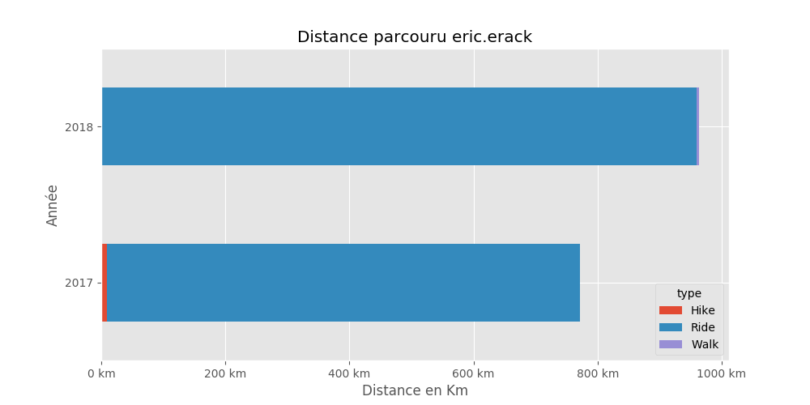
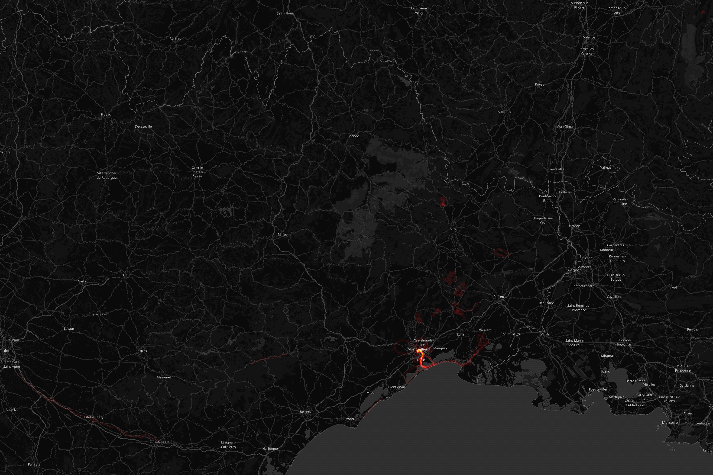

# Eric Erack

## Résumé

Distance totale parcourue pour toutes les activitées **1735 Km**

|   year |   Hike |   Ride |   Walk |
|-------:|-------:|-------:|-------:|
|   2017 |    9.7 |  762.4 |    0   |
|   2018 |    0   |  959.3 |    4.3 |

## Montpellier

#### Trajets les plus fréquents

#### Zones de croisements

#### Ensembles des trajets

## France

#### Trajets les plus fréquents

#### Ensembles des trajets

