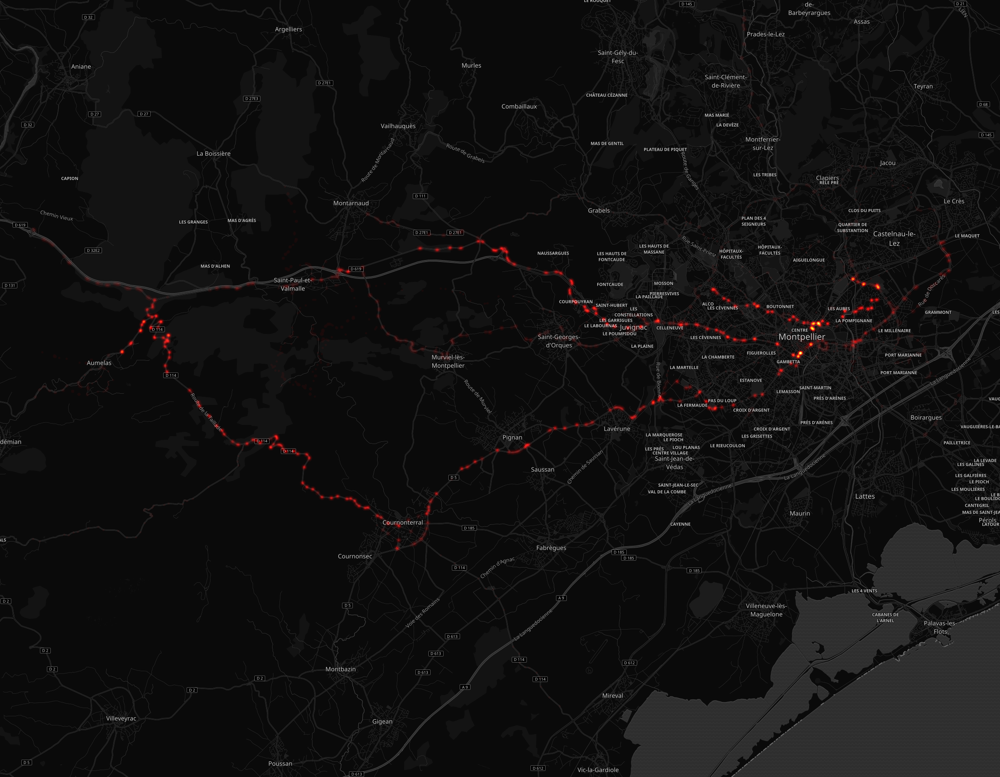

# Erick Blanchard

## Résumé

Distance totale parcourue pour toutes les activitées **8899 Km**

|   year |   Hike |   Ride |   Swim |   Walk |   Windsurf |
|-------:|-------:|-------:|-------:|-------:|-----------:|
|   2016 |    0   |  979.4 |    0   |    0   |       23.3 |
|   2017 |    1.4 | 2860.9 |    0.3 |    1.7 |       24.5 |
|   2018 |   52.6 | 4955.5 |    0   |    0   |        0   |

## Montpellier

#### Trajets les plus fréquents

#### Zones de croisements

#### Ensembles des trajets

## France

#### Trajets les plus fréquents

#### Ensembles des trajets

