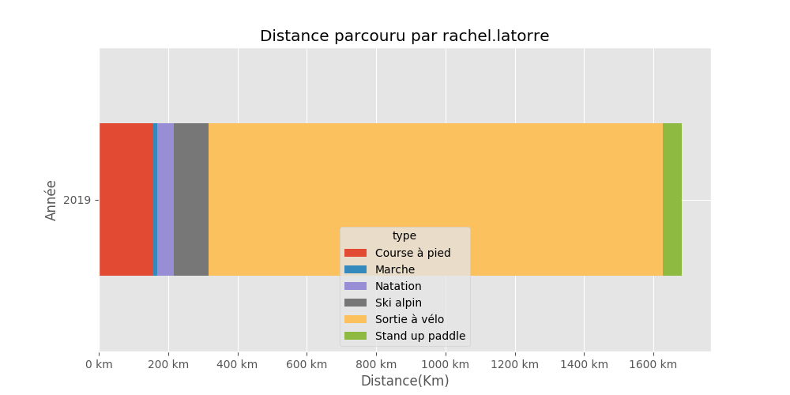

# Rachel Latorre

## Résumé

Distance totale parcourue pour toutes les activitées **1682.069 Km**

|   year |   Course à pied |   Marche |   Natation |   Ski alpin |   Sortie à vélo |   Stand up paddle |
|-------:|----------------:|---------:|-----------:|------------:|----------------:|------------------:|
|   2019 |           157.4 |     11.4 |       47.1 |         101 |            1311 |              54.1 |

Comparaison des économies entre un velo+frais (**0 €**) et un véhicule consommant **5.28 l**/100km pour un prix de **8.128 €** pour 100Km.

Sur l'ensenble des trajets vélo, **161.0 kg** d'émission de CO2 ont été évités et une économie de **111 €** a pu être réalisé.

|   year |   Nb trajets |   Distance(Km) |   Eco CO2 en Kg |   Eco Ess. en € |   Economie VS Auto-Moto |
|-------:|-------------:|---------------:|----------------:|----------------:|------------------------:|
|   2019 |          241 |        1311.04 |         161.258 |         110.757 |                 110.757 |

## Montpellier

#### Trajets les plus fréquents

#### Zones de croisements

#### Ensembles des trajets

## France

#### Trajets les plus fréquents

#### Ensembles des trajets

