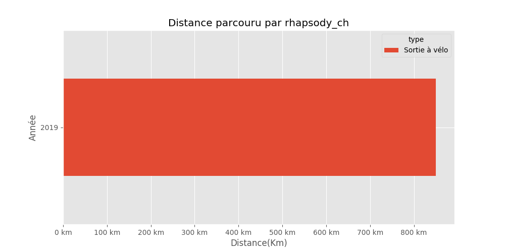
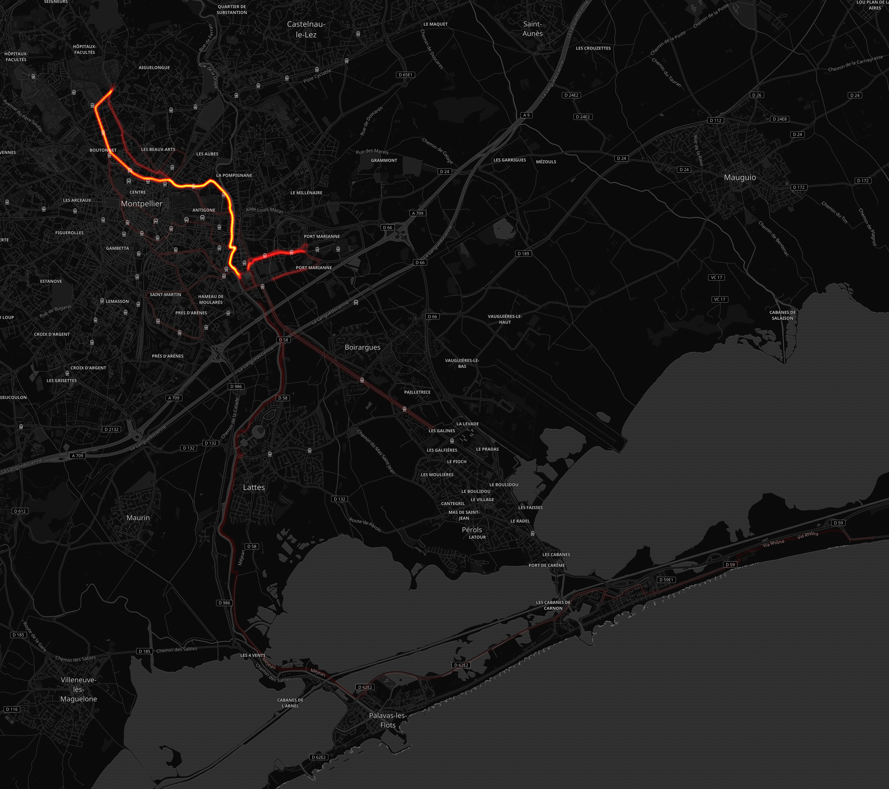
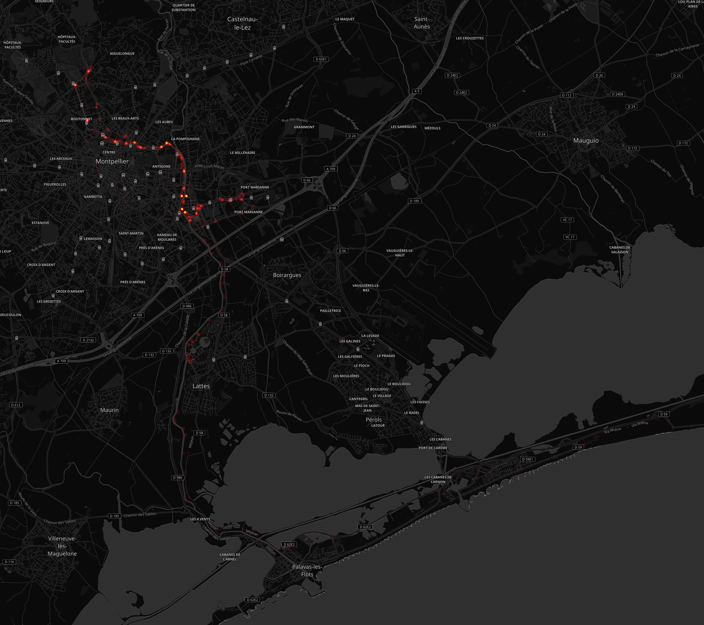
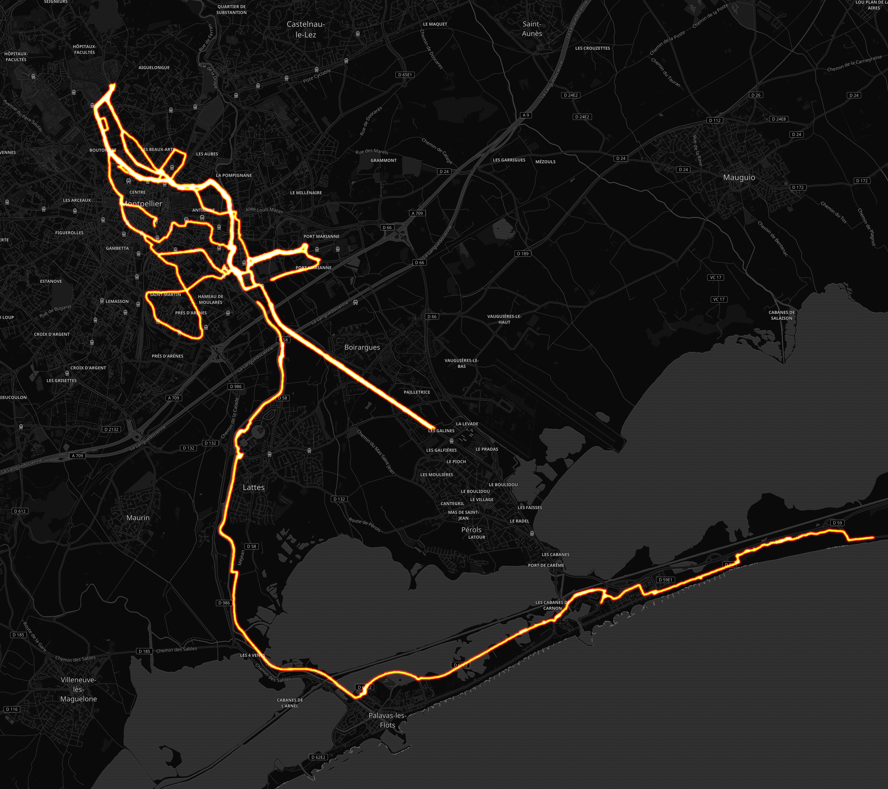

# rhapsody_ch

## Résumé

Distance totale parcourue pour toutes les activitées **850.06 Km**

|   year |   Sortie à vélo |
|-------:|----------------:|
|   2019 |           850.1 |

Comparaison des économies entre un velo+frais (**0 €**) et un véhicule consommant **5.28 l**/100km pour un prix de **8.128 €** pour 100Km.

Sur l'ensenble des trajets vélo, **105.0 kg** d'émission de CO2 ont été évités et une économie de **72 €** a pu être réalisé.

|   year |   Nb trajets |   Distance(Km) |   Eco CO2 en Kg |   Eco Ess. en € |   Economie VS Auto-Moto |
|-------:|-------------:|---------------:|----------------:|----------------:|------------------------:|
|   2019 |          136 |         850.06 |         104.557 |         71.8131 |                 71.8131 |

## Montpellier

#### Trajets les plus fréquents

#### Zones de croisements

#### Ensembles des trajets

## France

#### Trajets les plus fréquents

#### Ensembles des trajets

