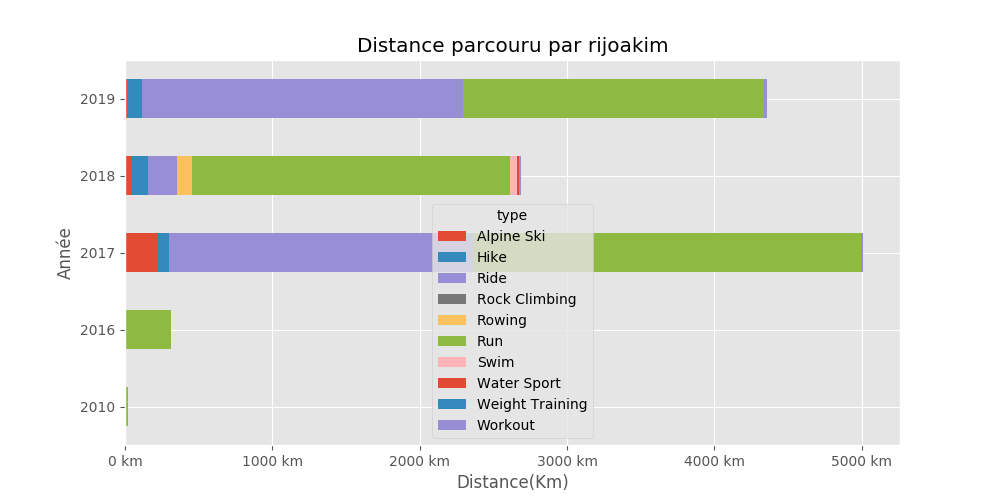

# rijoakim

## Résumé

Distance totale parcourue pour toutes les activitées **12387 Km**

|   year |   Alpine Ski |   Hike |   Ride |   Rock Climbing |   Rowing |    Run |   Swim |   Water Sport |   Weight Training |   Workout |
|-------:|-------------:|-------:|-------:|----------------:|---------:|-------:|-------:|--------------:|------------------:|----------:|
|   2019 |         12.9 |  100.4 | 2180.5 |               0 |      0   | 2040.1 |    3.6 |           0   |                 0 |      17.6 |
|   2018 |         47.5 |  105.7 |  199.4 |               0 |     99.2 | 2158   |   52.6 |          12.5 |                 0 |      14.7 |
|   2017 |        214.7 |   85.7 | 2058.3 |               0 |      0   | 2634.7 |    3.1 |           0   |                 0 |      11.8 |
|   2016 |          0   |    0   |    6.6 |               0 |      0   |  305.5 |    0   |           0   |                 0 |       0   |
|   2010 |          0   |    0   |    0   |               0 |      0   |   22.4 |    0   |           0   |                 0 |       0   |

Comparaison des économies entre un velo et l'utilisation d'un véhicule motorisé consommant **5.28 l**/100km pour un prix de **8.128 €** pour 100Km.

Sur l'ensenble des trajets vélo, **547.0 kg** d'émission de CO2 ont été évités et une économie de **375 €** a pu être réalisé.

|   year |   Nb trajets |   Distance(Km) |   Eco CO2 en Kg |   Eco Ess. en € |   Economie VS Auto-Moto |
|-------:|-------------:|---------------:|----------------:|----------------:|------------------------:|
|   2019 |           67 |        2180.45 |       268.195   |      184.204    |              375.495    |
|   2018 |           10 |         199.38 |        24.5237  |       16.8436   |              191.291    |
|   2017 |          148 |        2058.33 |       253.175   |      173.888    |              174.447    |
|   2016 |            1 |           6.62 |         0.81426 |        0.559258 |                0.559258 |

## Montpellier

#### Trajets les plus fréquents

#### Zones de croisements

#### Ensembles des trajets

## France

#### Trajets les plus fréquents

#### Ensembles des trajets

