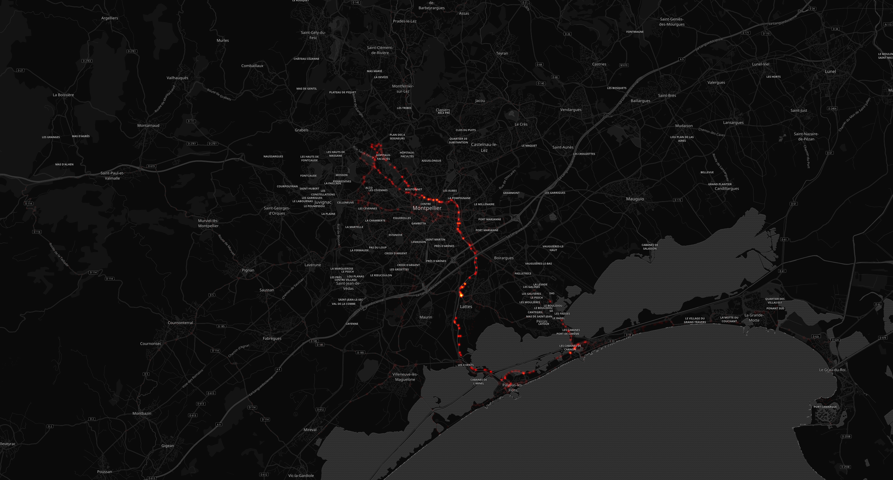

# Seb Bob

## Résumé

Distance totale parcourue pour toutes les activitées **12139 Km**

|   year |   Hike |   InlineSkate |   Ride |   Run |   Snowshoe |   Swim |   Walk |   WaterSport |   Workout |
|-------:|-------:|--------------:|-------:|------:|-----------:|-------:|-------:|-------------:|----------:|
|   2014 |    0   |           0   |   37.4 |   0   |        0   |    0   |      0 |          0   |       0   |
|   2015 |    0   |           0   |    8   |  66.3 |        0   |    0   |      0 |          0   |       0   |
|   2016 |   16   |          10.4 | 1047   | 403.4 |        3.5 |  121.4 |      0 |          0   |       0   |
|   2017 |   16.9 |           1.2 | 3419.5 | 700.9 |        0   |  651.4 |      0 |          4.3 |      22.7 |
|   2018 |   12.6 |           0   | 3905.9 | 751   |        0   |  787.7 |      6 |          2.1 |      54.4 |
|   2019 |    0   |           0   |   86.3 |   0   |        0   |    2.6 |      0 |          0   |       0   |

## Montpellier

#### Trajets les plus fréquents

#### Zones de croisements

#### Ensembles des trajets

## France

#### Trajets les plus fréquents

#### Ensembles des trajets

