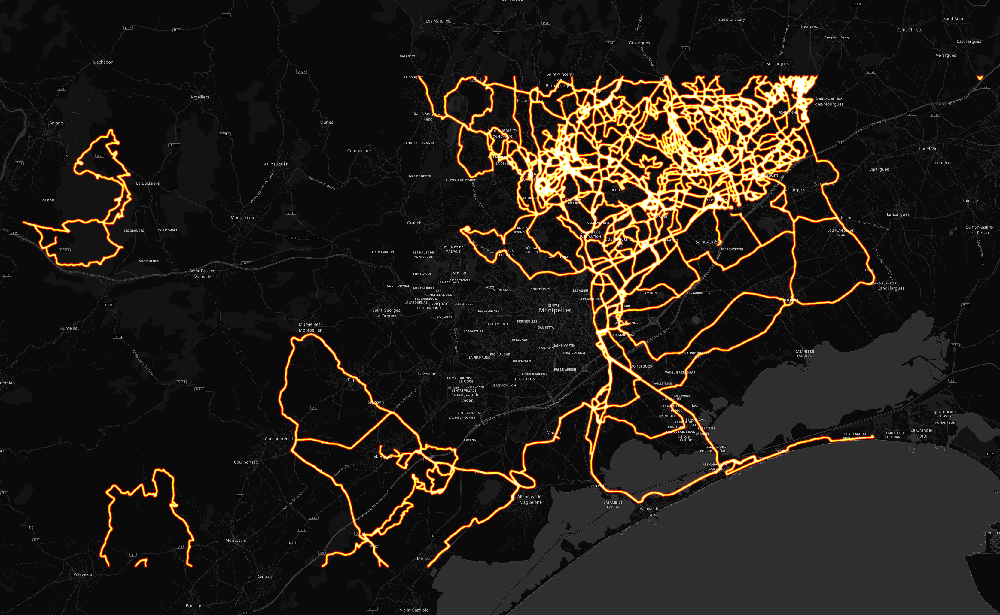

# Thomas Girard

## Résumé

Distance totale parcourue pour toutes les activitées **9322 Km**

|   year |   Hike |   Ride |   Run |
|-------:|-------:|-------:|------:|
|   2019 |    0   |  186   |   0   |
|   2018 |   21.5 | 4552.8 |   0   |
|   2017 |    0   | 1409.3 |   0   |
|   2016 |    0   |  901.9 |   0   |
|   2015 |    0   | 1053.5 |   0   |
|   2014 |    0   | 1136.2 |   0   |
|   2010 |    0   |    0   |  61.8 |

## Montpellier

#### Trajets les plus fréquents

#### Zones de croisements

#### Ensembles des trajets

## France

#### Trajets les plus fréquents

#### Ensembles des trajets

