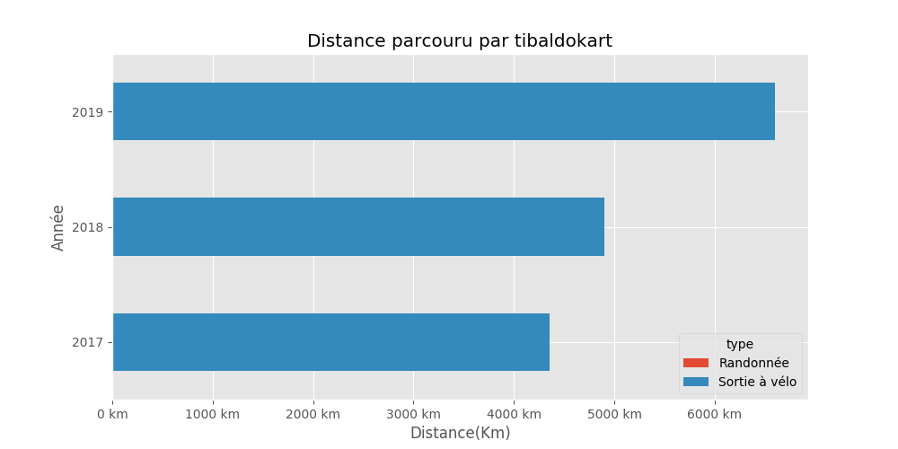

# tibaldokart

## Résumé

Distance totale parcourue pour toutes les activitées **15858 Km**

|   year |   Randonnée |   Sortie à vélo |
|-------:|------------:|----------------:|
|   2019 |         0   |          6601.2 |
|   2018 |         0   |          4902   |
|   2017 |         3.1 |          4351.4 |

Comparaison des économies entre un velo et l'utilisation d'un véhicule motorisé consommant **5.28 l**/100km pour un prix de **8.128 €** pour 100Km.

Sur l'ensenble des trajets vélo, **1950.0 kg** d'émission de CO2 ont été évités et une économie de **1339 €** a pu être réalisé.

|   year |   Nb trajets |   Distance(Km) |   Eco CO2 en Kg |   Eco Ess. en € |   Economie VS Auto-Moto |
|-------:|-------------:|---------------:|----------------:|----------------:|------------------------:|
|   2019 |          551 |        6601.18 |         811.945 |         557.668 |                1339.4   |
|   2018 |          606 |        4902.04 |         602.951 |         414.124 |                 781.731 |
|   2017 |          572 |        4351.4  |         535.222 |         367.606 |                 367.606 |

## Montpellier

#### Trajets les plus fréquents

#### Zones de croisements

#### Ensembles des trajets

## France

#### Trajets les plus fréquents

#### Ensembles des trajets

