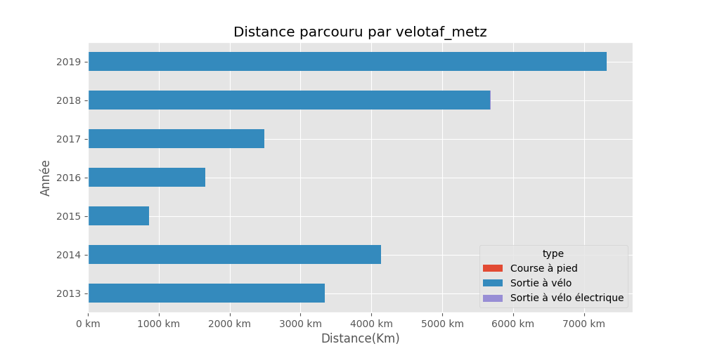

# velotaf_metz

## Résumé

Distance totale parcourue pour toutes les activitées **25492 Km**

|   year |   Course à pied |   Sortie à vélo |   Sortie à vélo électrique |
|-------:|----------------:|----------------:|---------------------------:|
|   2019 |             0   |          7320.7 |                        0   |
|   2018 |             0   |          5675.5 |                        7.3 |
|   2017 |             0   |          2492.4 |                        0   |
|   2016 |             5.5 |          1648.1 |                        0   |
|   2015 |             0   |           864.8 |                        0   |
|   2014 |             0   |          4137.5 |                        0   |
|   2013 |             0   |          3340.6 |                        0   |

Comparaison des économies entre un velo et l'utilisation d'un véhicule motorisé consommant **5.28 l**/100km pour un prix de **8.128 €** pour 100Km.

Sur l'ensenble des trajets vélo, **3134.0 kg** d'émission de CO2 ont été évités et une économie de **2153 €** a pu être réalisé.

|   year |   Nb trajets |   Distance(Km) |   Eco CO2 en Kg |   Eco Ess. en € |   Economie VS Auto-Moto |
|-------:|-------------:|---------------:|----------------:|----------------:|------------------------:|
|   2019 |          597 |        7320.68 |         900.444 |        618.451  |                2152.51  |
|   2018 |          504 |        5675.52 |         698.089 |        479.468  |                1534.06  |
|   2017 |          358 |        2492.38 |         306.563 |        210.556  |                1054.59  |
|   2016 |          182 |        1648.1  |         202.716 |        139.231  |                 844.034 |
|   2015 |           64 |         864.79 |         106.369 |         73.0575 |                 704.802 |
|   2014 |          458 |        4137.48 |         508.91  |        349.534  |                 631.745 |
|   2013 |          314 |        3340.56 |         410.889 |        282.211  |                 282.211 |

## Montpellier

#### Trajets les plus fréquents

#### Zones de croisements

#### Ensembles des trajets

## France

#### Trajets les plus fréquents

#### Ensembles des trajets

