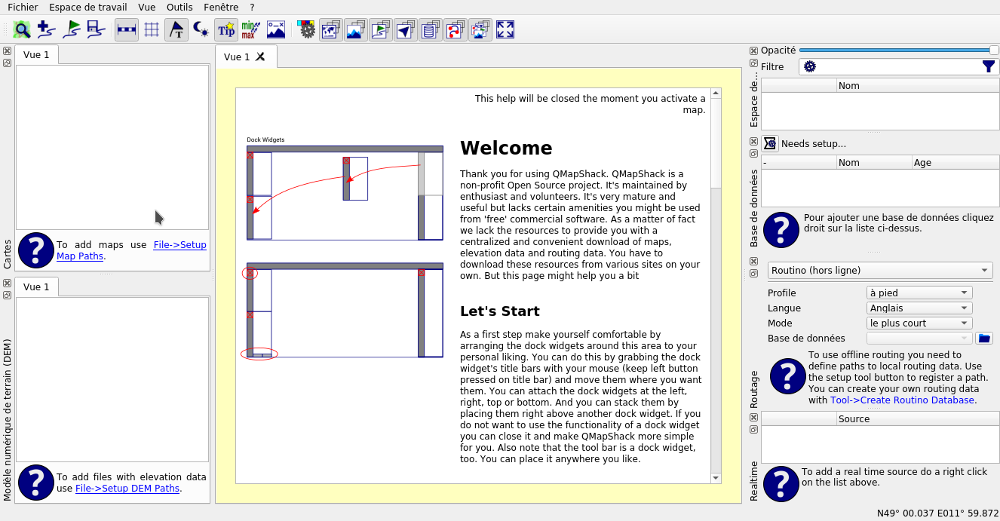

# QMapShack

QMapShack est un gestionaire de carte et visualiseur de GPX/POI et bien plus :)

Par defaut, QMapShack n'est livré avec aucune carte online. Il faut donc télécharger la configuration des cartes online depuis [ce lien](http://www.mtb-touring.net/?ddownload=5012). [Plus d'information sur la configuration des cartes](https://bitbucket.org/maproom/qmapshack/wiki/DocMapDemSources)

Ensuite décompreser le contenu dans `$HOME/.QMapShack/maps`

Configurer ensuite QMapShack

Cliquer bouton droit et selectionner **Configurer les repertoires des cartes**

Ajouter le repertoire `$HOME/.QMapShack/maps`

Il vous manque plus qu'à ouvrir votre traces ou GPX et de visualiser le résultat

Le quicksart guide [en anglais](https://bitbucket.org/maproom/qmapshack/wiki/DocQuickStartEnglish)

Exemple en videos de **Zbigniew K** :

[Video 1](https://www.youtube.com/watch?v=7I64J8zvRg0)

[Video 2](https://www.youtube.com/watch?v=DftkWcKbjWY)

[Video 3](https://www.youtube.com/watch?v=K0cvYoy1hgY)

[Video 4](https://www.youtube.com/watch?v=pNDCMh43INo)
